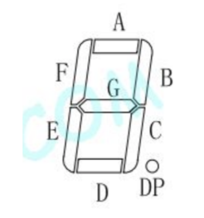
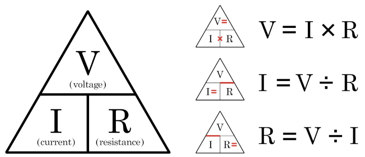
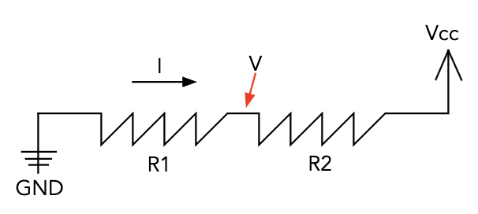
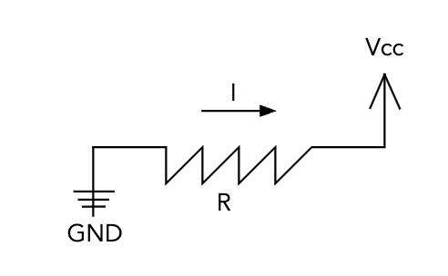
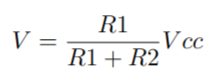
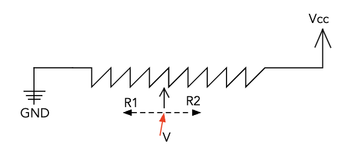
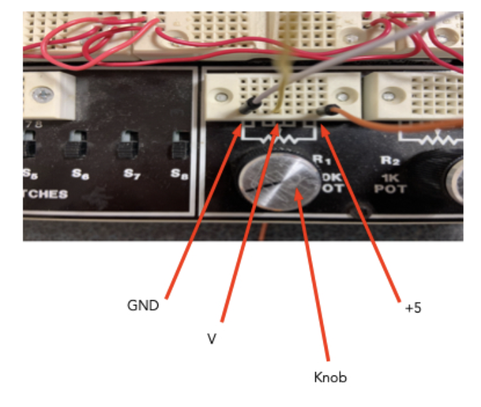
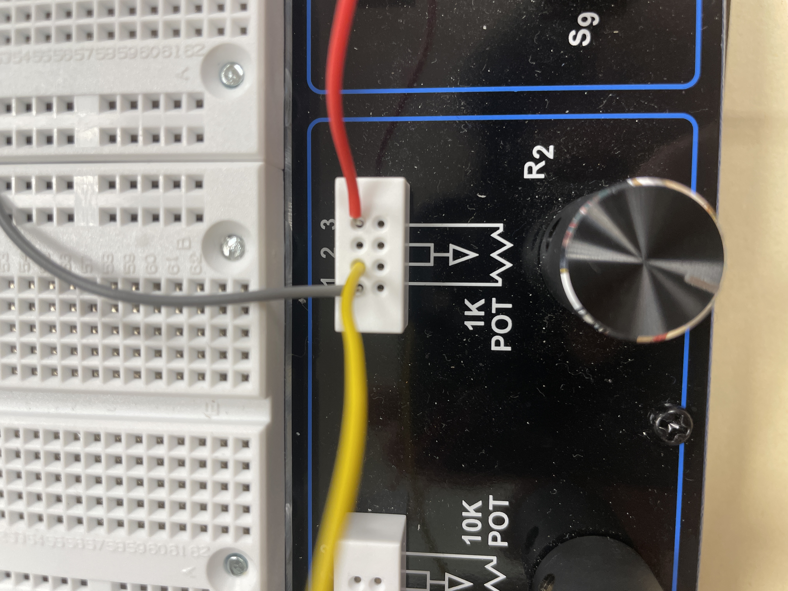
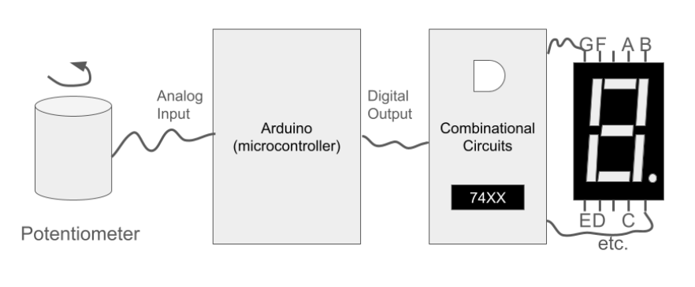
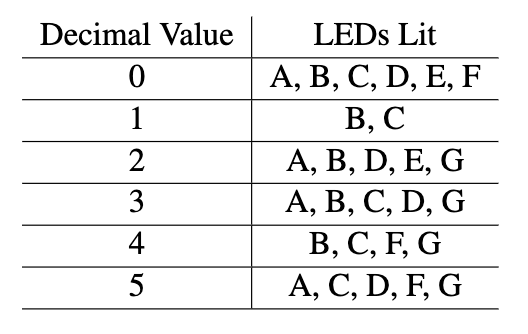

# Lab 3: Ramp Circuit

# Overview and Motivation
Welcome to the Lab 03 of CS281: Introduction to Computer Systems! 
This lab will use an analog input to display a number on a 7-segment display. A 7-segment display contains 7 leds that are arranged to form a number.. By the end of this lab, you'll be adept at working with essential circuit components and potentiometer.

<br>

# Objectives of the Lab
1. Familiarize yourself with the potentiometer and learn to control it.
2. Understand and construct an 7-segment display by using circuit chips and potentiometer.
3. Develop the ability to control data from potentiometer in a way to associate the input value to the number that will be displayed.
4. Gain hands-on experience in controlling circuits with the Arduino and potentiometer.
 
# Materials
- PB-503 breadbofard prototyping station (integrated device with a number of electrical components like switches)
- Arduino kit
- Potentiometer
- 7404 NOT gate IC
- 7408 AND gate IC
- 7432 OR gate IC
- Resistor
- 5161AS 7-segment
- Wires
- LED
- Arduino controller and USB cable


# Building the Lab: The Voltage Divider
## 0 What do we need to know?
First of all, we need to know about hte Voltage Divider!<br>
Voltage divider is a arrangement of resistors configured to create a target voltage. <br>
We will use below equation to calculate the volage current.
<br>

We will have a constant voltage with 5 volts and the current is inversely proportional to the resistance. <br>
Which means changing the resistance will inversly change the current that bigger the resistance, smaller the current. <br>
<br>
<br>

In order to finout the voltage of the V in the above picture, we will use below equation since we know the current will be the same across the curcit.
<br>

Since the voltage of this lab will be 5V, by changing the "R1" and "R2",  we can generate any voltage V that we want between 0 and 5 volts. <br>


Now we need to know that is a "potentiometer". <br>
A potentiomter is a variable resistor that allows us to fine tune our voltage divider. <br>
This means that by using potentiometer, we can vary the value of "R1" and "R2" in a way to change the value of V like the photo below. <br>
The value that is written in the potentiometer means that the sum of "R1" and "R2" is the number (ex 10KΩ).
<br>
This is how we will set up the poteniometer!

## 1. Project Step

<br><br>

Let's start building and testing the potentiometer! <br>
We will generate voltage V in a range of 0 to 5 volts using the voltage divider from the potntiometer. <br>
We will use this output signal as a input the the Aruino for "analog input" pin 0 (A0).<br>
<br><br>
#### Note: Do not forget to GND the wire to the leftmost connection column of the potentiometer and +5V to the rightmost column.
#### Note: Middle connections are all the same and you will wire one of these middle connections for the output of the voltage V. 
#### Note: Make sure the input is pinned to analog input NOT digital pin 0. <br>
<br>
<br> <br>
We will use output pins 11, 12, and 13 to produce a binary signal (pin11 =B0, pin12 = B1, pin13 = B0) based on the potentiometer reading. <br>
These signals will be input to breadboard logic so that we can express numbers in 7-segment display. 
<br><br>
We will try to signal the correct LEDs based on the above chart to display the correct decimal value. <br>
<br>
<br>
Now we will hook up the potentiometer to the Arduino and calibrate. <br>
1. Let's start by connecting the V output of the potentiometer to the A0 pin on the Arduino.
<br><br>

#### Note: Be sure to connect Arduino to the breadboard vid GND ELSE there will be garbage reading in potentiometer.

<br><br>
2. We will set up the Arduino program and compile it to write it to the board.
#### Note you will use the bit shifting and masking to get the value that you want for B0, B1, B2

3. Use below code in the Arduino program

#### Note: You may want to calibrate the analog input by changing the number taht you are deviding the paramter val
#### Note: You may use print statement to check the value and make sure pins 11-13 are pouptiing the corresponding binary value for the LEDs
```
const int potpin = 0;
const int WAIT = 1000; // 1 second delay
void setup () {
  Serial.begin(9600);
  pinMode(11,OUTPUT);
  pinMode(12,OUTPUT);
  pinMode(13,OUTPUT);
  pinMode(potpin,INPUT);
}
void loop () {
  int val;
  int dval;
  int bitval;
  val = analogRead(potpin);
  dval = val/171; // normalizing factor-->adjust this to get the range you want
  Serial.print("From Pot: ");
  Serial.println(val);
  Serial.print("Decimal Value Conversion: ");
  Serial.println(dval);
  //use bit ops to get each bit!
  bitval = dval & 1;
  digitalWrite(11,bitval); // signal C
  dval = dval >> 1;
  bitval = dval & 1;
  digitalWrite(12,bitval); // signal B
  dval = dval >> 1;
  bitval = dval & 1;
  digitalWrite(13,bitval); // signal A
  delay(WAIT);
}
```

## 2. Testing
https://github.com/mlcourses/lab-3-blog-post-group2_cs281/assets/108073642/1d9d0539-d0f4-45af-96cb-9cb0b0d6a2df


# Reading and Converting the Potentiometer Output
## 0 About

## 1. Project Step

## 2. Testing


# Building the Combinational Logic to Display DVal
## A LED
### 0 About
<br>
One important thing to note before we begin constructing these circuits is we have a limited number of gates, so it is important to use all the inputs in each gate before using another one.

 
### 1. Project Step
LED A is the most complicated circuit out of all the LEDs. This one involves two AND gates and two OR gates, as well as two NOT gates. We can use the 7404 NOT gate, 7408 AND gate, and 7432 OR gate to construct this on the breadboard. This circuit starts by inserting B2 and B0 into the inverter and then putting each of those outputs into an input on the AND gate. For the other AND gate, this will just take input from B2 and B0 with no inversion. For this second AND gate, you will want to make the output of it one of the inputs for the OR gate. The second input for this OR gate will be B1. You will then make the output of that OR gate an input for the other OR gate. The second input for this will be the output of the first OR gate.


### 2. Testing


### Example tests:

## B LED
### 0 About
<br>


 
### 1. Project Step
The circuit for LED is very simple. This only uses one OR gate and the inputs are B0 and ∼B1.


### 2. Testing


### Example tests:

## C LED
### 0 About
<br>


 
### 1. Project Step
LED C is a little more complex than B but not quite as complicated as A. You will do the same thing you did in B, except this time you will put the input of that OR gate into the input of another OR gate and the second input is B2.


### 2. Testing


### Example tests:

## D LED
### 0 About
<br>


 
### 1. Project Step
This one is very simple. Its the same exact circuit as A, therefore you do not need to reconstruct it. You may simply make another output wire from A and connect it to the LED D pin on the 7-segment.


### 2. Testing


### Example tests:

## E LED
### 0 About
<br>


 
### 1. Project Step


### 2. Testing


### Example tests:

## F LED
### 0 About
<br>


 
### 1. Project Step


### 2. Testing


### Example tests:

## G LED
### 0 About
<br>


 
### 1. Project Step


### 2. Testing


### Example tests:

# Testing Number Display


https://github.com/mlcourses/lab-3-blog-post-group2_cs281/assets/108073642/cf37c88d-062a-487c-b540-a757192dc038


https://github.com/mlcourses/lab-3-blog-post-group2_cs281/assets/108073642/41df861f-9340-4d9a-9abd-e5258204418c


https://github.com/mlcourses/lab-3-blog-post-group2_cs281/assets/108073642/7650fa52-f56d-4643-9e5a-d761c9901726


https://github.com/mlcourses/lab-3-blog-post-group2_cs281/assets/108073642/9afb9545-eb94-414a-a182-eecffeac7204


https://github.com/mlcourses/lab-3-blog-post-group2_cs281/assets/108073642/6972c874-b9ce-4fbc-a84e-421ad199cb0e


https://github.com/mlcourses/lab-3-blog-post-group2_cs281/assets/108073642/2ddb0cf6-cff4-4903-a388-4d77e15e3163


# Conclusion


